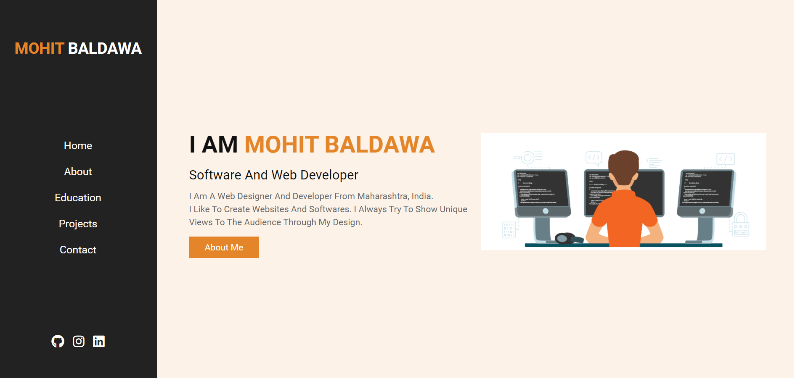

<h1 align="center">Hi 👋, I'm Mohit Baldawa</h1> 

<h1 align="center"> Projects</h2>
<h2>Portfolio Website : 

 <h4> <a href="https://github.com/MohitBaldawa/Portfolio" target="_blank"> Github Repo </a> </h4>
 <h4> <a href="https://mohitbaldawa.com" target="_blank"> Deployed here </a> </h4> 

  

  
  
   
 

  </h2> 
 

<h2>GoWise E-Learning Website :
 <h4> <a href="https://github.com/MohitBaldawa/GoWise-E_learning-Website" target="_blank"> Github Repo </a> </h4> 
  <h4> <a href="https://gowise-e-learning.herokuapp.com/" target="_blank"> Deployed here  </a> </h4> 

   
 
    
  
    
  
     
 

  </h2>  
 

<h2>Covid-19 Tracker Web Application:
 <h4> <a href="https://github.com/MohitBaldawa/Covid-19-Tracker-web-application" target="_blank"> Github Repo </a> </h4>
 <h4> <a href="https://mohitbaldawa.github.io/Covid-19-Tracker-web-application/" target="_blank"> Deployed here </a> </h4> 

   

  
  
 

  </h2>  
 
 
 <h2>Secret Message Sharing Using QR Code :
 <h4> <a href="https://github.com/MohitBaldawa/Secret-Message-Sharing" target="_blank"> Github Repo </a> </h4>
 <h4> <a href="#" target="_blank"> Deployed here </a> </h4> 

   
 
    
  
    
  
     
 

  </h2>  
 

